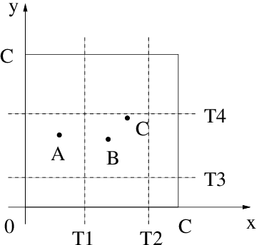

# k-Nearest Neighbors

k-NN(k- Nearest Neighbors) is a supervised machine learning algorithm that is based on distance functions. k-NN can be used in both classification and regression tasks.

<p align="center">
  
</p


 

> These algorithms are **lazy learners** as they simply “remember” the training data; there are no training steps involved.
 

$$
\lt x^{i}, y^{i}\gt \in D 
$$

### Algorithm for 1-NN

```python
# Given data: (X, y)
# Predict f(x[q]) -> query point
closest_point = None
closest_dist = np.inf
for i in range(data):
	current_dist = get_distance(x[i], x[q])
	if currenct_dist < closest_dist:
		closest_dist = current_dist
		closest_point = x[i]

```

### Continuous Distance Metrics

- Commonly used: Euclidean Distance (L2)
    - The features have to be on the same scale. So that a feature does not dominate in the distance computation
    
    $$
    d(x, y) = \sqrt{\sum_{i=1}^{n}(y_i - x_i)^2}
    $$
    
- Manhattan Distance:

$$
d(x, y) = \sum_{i=1}^{n}|y_i - x_i|
$$

- The Minkowski Distance is a generalization of the Euclidean and Manhattan distance:
    - *p = 1 (Manhattan), p = 2 (Euclidean)*

$$
d(x, y) = [\sum_{i=1}^{n}(|y_i - x_i|)^{p}]^{1/p}
$$

- Mahalanobis Distance: considers the distribution of the features
- Cosine similarity

$$
\cos(\theta) = a^{T}b/||a||.|b|
$$

### Discrete Distance Measures

- Hamming Distance:
    - Data is binary in nature: {1, 0, 1, 0 …}
    
    $$
    d(x_a, x_b) = \sum_{j=1}^{m}|x_j^{a} - x_j^{b}|;where: x_j\subseteq {0,1}
    $$
    

### KNN for Classification

Let’s consider *k* to be equal to *5*

$$
D_k = [\lt x^{1}, f(x^{1}) \gt,... ,\lt x^{k}, f(x^{k}) \gt]
$$
- argmax function:
$$h(x^{q}) = \arg\max_{y\in (1,...,t)}\sum_{i=1}^{k}\delta(y, f(x^{i}))$$
- delta which is an *indicator* funcion:
$$\delta(i, j) =I(i=j)$$

Intuitively;

$$
h(x^{t}) = mode([f(x^{1}), ...,f(x^{k})])
$$

### KNN for Regression

It’s simpler than classification. We only take the average of the k-Nearest points

$$
h(x^{t}) = 1/k(\sum_{i=1}^{k}f(x^{i}))
$$

### Big-O Runtime Complexity

The run time complexity of a naive implementation of k-nearest neighbors is *O(kn)*

Improving computational performance of k-NN would be to use a priority queue so that we **don’t sweep across the training data *k* times**.

- A technique used to constraint the data space is called bucketing:
    - For example; If our query is point A, then we will only need to search for the points in the bucket (T1, T4)

<p align="center">
  
</p


- We can also use dimensionality reduction to lower the runtime complexity
- Editing/pruning is another technique used to reduce the runtime.
    - It works by removing points in a way that would not effect the decision boundaries
    

### Curse of Dimensionality

If there are more features than observations then **we run the risk of massively overfitting our model.** This would lead to terrible real life performance. Don’t forget that the main goal of ML is *generalization.* 

### Improving Predictive Performance

In ML we have options that can be though as algorithm settings. These options are known as *hyperparameters*  Using these options, we can improve our predictive ability. 

**k-NN hyperparameters**

1. Value of k(If the problem is binary classification, try to use odd k values; just in case of a tie)
2. Scaling of the feature aces
3. Distance measures
4. Weighting of the distance measures

## Distance-weighted kNN

$$
h(x^{t}) = \arg\max_{j\in(1,...,p)}\sum_{i=1}^{k}w^{i}\delta(j, f(x^{i}))
$$

- weighting factor:
$$w^{i} = \frac{1}{d(x^{i}, x^{t})^{2}}$$
