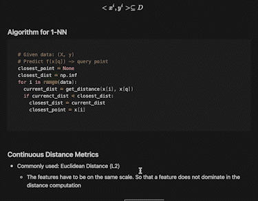

# Introduction to Machine Learning
A repository containing detailed notes, codes, and other supplementary materials for every machine/deep learning algorithm you could think of!

## Welcome to the Universe of Data :chart_with_upwards_trend:
#### Please feel free to check out the Notion website for all related notes and documents [ML Notes](https://normalized.notion.site/Introduction-of-Machine-Learning-727cd9a9f2eb40b08f8be972390577e9)

## Table of Contents

- [KNN](./KNNs/)
- [Preprocessing](./data_preprocessing/)
- [Perceptron](./perceptron/§)
## Contributing
Please feel free to contribute. Pull requests are welcome. For major changes, please open an issue first to discuss what you would like to change. My goal is to manage a repositor that is comprehensive in nature, and easy to understand for beginners. 

## License
[MIT](https://choosealicense.com/licenses/mit/)
