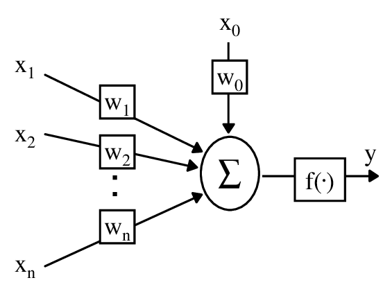

# Perceptron

In machine learning, the perceptron is an algorithm for supervised learning of binary classifiers. A binary classifier is a function which can decide whether or not an input, represented by a vector of numbers, belongs to some specific class. It is a type of linear classifier, i.e. a classification algorithm that makes its predictions based on a linear predictor function combining a set of weights with the feature vector [Wiki/Perceptron](https://www.wikiwand.com/en/Perceptron)

## McCulloch-Pitts Neuron

  

## The Perceptron Learning Rule
Net output
$$
f_{\theta} (\sum_{i=1}^{m}x_{i}w_{i}) = \hat{y}
$$

Threshold activation function

  

## The learning algorithm
* If correct: Do nothing
* **If incorrect, scenario a):** If output is 0 and target is 1, *add input vector to weight vector*
* **If incorrect, scenario b):** If output is 1 and target is 0, *subtract input vector from weight vector*

**Net output** For each point in the dataset
$$
\hat{y^{[i]}} := \sigma(x^{[i]T}w)
$$
**Error**
$$
err := (y^{[i]}-\hat{y^{[i]}})
$$

**Update rule**
$$
w:=w+err*x^{[i]}
$$
